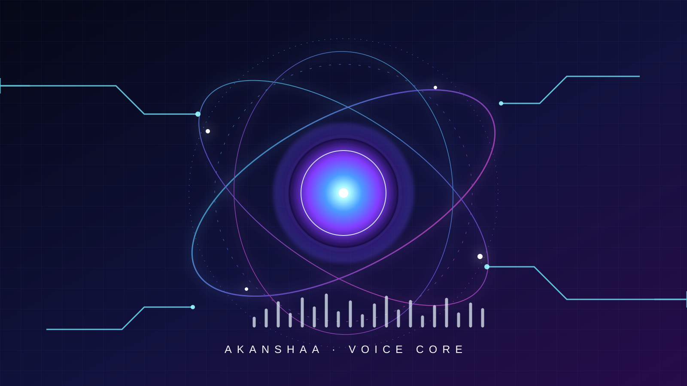
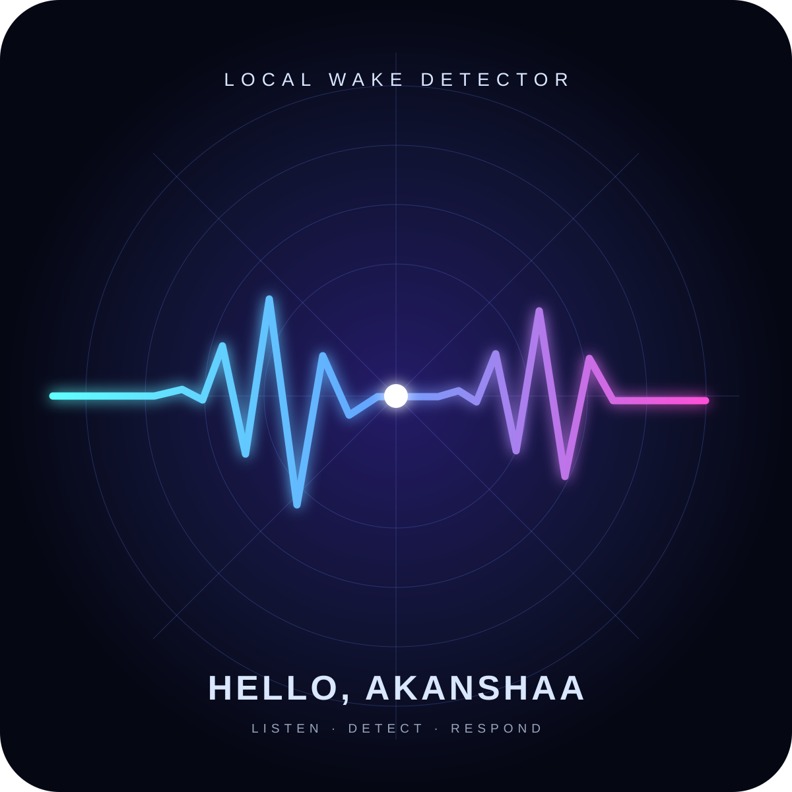
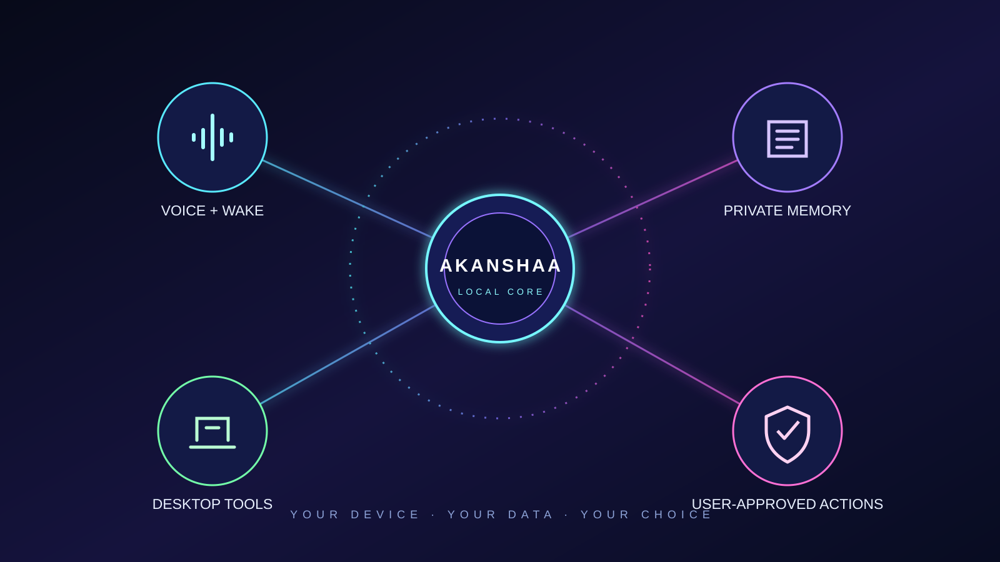

# Akanshaa for Android

Akanshaa is a small Android voice assistant demo built in Java. It combines Android speech recognition and speech output with Gemini for general questions, plus a set of on-device actions. The project uses a lightweight `aapt2 → javac → d8 → zipalign → apksigner` build script rather than Gradle.

> **Demo build:** `0.1-dev` (`com.akanshaa.mobile`). Review the feature limits below before installing. This is not the later Akanshaa 1.7 development project.

## Project artwork

Click an image to open its full-size SVG. The [interactive gallery](artwork/index.html) lets you switch images, zoom, and use the arrow keys.

| Neural voice core | Wake signal | Local-first architecture |
|---|---|---|
| [](artwork/01-neural-orb.svg) | [](artwork/02-wake-signal.svg) | [](artwork/03-local-first.svg) |

The README thumbnails are clickable static previews. GitHub does not run interactive scripts embedded in Markdown; to use the gallery controls, download/clone the repository and open `artwork/index.html` in a browser.

## Download

The signed demo APK is in [`release/Akanshaa-v0.1-dev.apk`](release/Akanshaa-v0.1-dev.apk). It was built and signature-verified with the script below. Runtime behavior still needs to be checked on the target Android device.

## Features in this demo

- Press-to-talk speech recognition and spoken replies.
- Gemini-backed answers after you add your own API key.
- Basic local phone actions such as opening supported apps, calls, and SMS.
- Weather and time/date commands.
- Optional floating orb service and notification listener.
- Recent conversation storage and user settings.

See [Feature status and limitations](docs/FEATURES.md) for setup requirements and boundaries. The app has **no custom wake-word model** and does not provide unrestricted control of other apps.

## Build on Windows

Requirements: Android SDK platform-tools/build-tools/platform (the script auto-selects an installed version) and a JDK. The signing key is kept outside the repository in the current Windows user profile; never commit that key.

```powershell
powershell.exe -NoProfile -ExecutionPolicy Bypass -File .\tools\build-apk.ps1 `
  -ProjectDir .\app `
  -Out .\build\akanshaa-v0.1.apk `
  -BuildDir .\build-tools-out
```

The script checks that the APK contains the manifest and `classes.dex`, then verifies its signature. Build outputs stay local and are not committed.

## Install

With USB debugging enabled and the device connected:

```powershell
$adb = "$env:LOCALAPPDATA\Android\Sdk\platform-tools\adb.exe"
& $adb install -r .\release\Akanshaa-v0.1-dev.apk
```

On first launch, grant only the Android permissions needed for the actions you intend to use. Add a Gemini API key in the app to enable AI answers and voice input. Do not share your key or signing key.

## Repository layout

- `app/` — Android manifest, resources, and Java application source.
- `artwork/` — original SVG artwork and the browser gallery.
- `docs/` — build, setup, feature, and privacy notes.
- `release/` — signed demo APK.
- `smoke/` — tiny packaging fixture used to exercise the build pipeline.
- `tools/build-apk.ps1` — local APK build/sign/verification script.

## License

No license file is included yet. Unless a license is added, the source is provided without an explicit open-source reuse grant.
